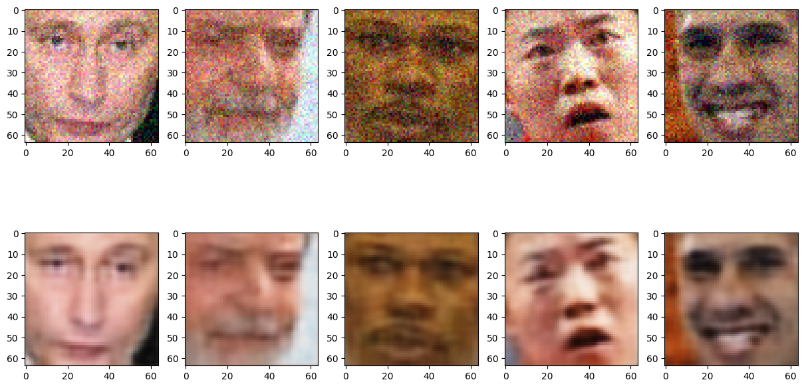
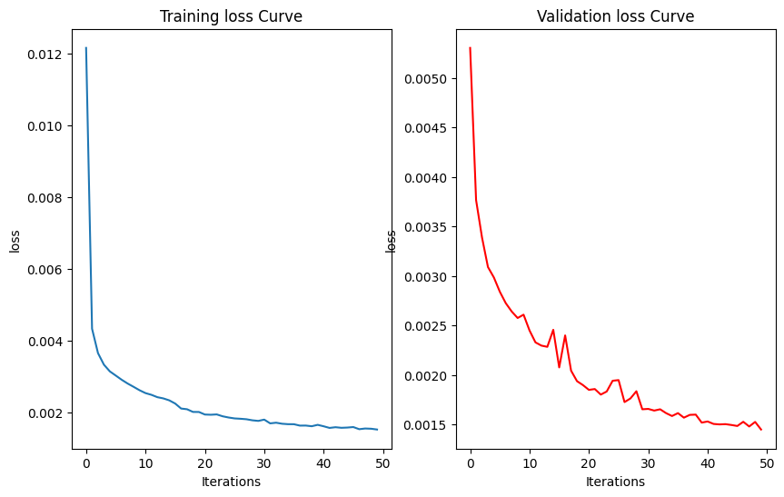
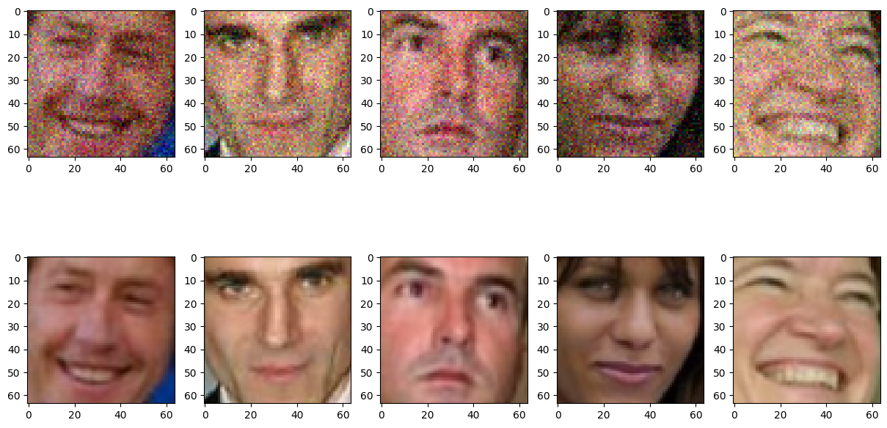

# Fully Convolutional Networks for Image Denoising

This project demonstrates the implementation of a fully convolutional network for image denoising using the color version of the LFWcrop dataset. It aims to reconstruct clean images from their noisy counterparts by leveraging a small yet effective autoencoder architecture.

## **1. Project Overview**
### **Objective**
To build a fully convolutional network capable of removing Gaussian noise from images and achieving accurate reconstruction.

### **Dataset**
The LFWcrop dataset was used for this project:
- Color images of dimensions 64x64.
- Ground truth outputs: Clean images.
- Inputs: Noisy images (Gaussian noise added with a standard deviation of 10% of the maximum pixel value).

## **2. Methodology**

### **Data Preprocessing**
- Images were normalized to the [0, 1] range and Gaussian noise was applied.
- The dataset was split into training (80%), validation (10%), and test (10%) sets.

### **Network Architecture**
A fully convolutional autoencoder was designed:
- **Encoder**: 4 convolutional layers with ReLU activation and 3 average pooling layers, reducing input size to (32, 32, 8, 8).
- **Decoder**: 4 transposed convolutional layers, restoring dimensions to (32, 3, 64, 64).

### **Training Details**
- **Loss Function**: Mean Squared Error (MSE).
- **Optimizer**: Adam optimizer with a learning rate of 0.001 and weight decay of \(1 \times 10^{-5}\).
- Trained for 50 epochs with batch size 32.

### **Evaluation Metrics**
- Quantitative evaluation: Mean Squared Error (MSE).
- Qualitative evaluation: Visual comparison of noisy and denoised images.

## **3. Results**

### **Quantitative Evaluation**
- **Mean Squared Error on one batch of Test Set**: 0.0014.
- **Mean Squared Error on the whole Test Set**: 0.0015.

### **Qualitative Evaluation**
Below are examples of noisy images (top row) and their denoised reconstructions (bottom row):



### **Training and Validation Loss Curves**
The training and validation loss curves demonstrate smooth convergence over 50 epochs:



### **Example Processed Images**
Illustration of noisy and clean images used for training:



## **4. Discussion on Model Performance**

- The model effectively removes noise but sometimes produces slightly blurry reconstructions due to the smoothing of pixel values.
- Given the low quality of the original images, the results are impressive, demonstrating the model's capability to generalize well.

## **5. Usage Instructions**

### **Dependencies**
Install the required dependencies by running:
```bash
pip install -r requirements.txt
```

### **Steps to Run the Project**
1. Clone the repository:
   ```bash
   git clone https://github.com/your-repository.git
   cd your-repository
   ```

2. Download the LFWcrop dataset and place it in the `data/` directory.

3. Run the main script:
   ```bash
   python main.py
   ```

4. Outputs (e.g., plots, denoised images) will be saved in the `plots/` folder.

## **6. File Structure**
```bash
.
├── models/                # Saved models (e.g., AutoEncoder.pth)
├── plots/                 # Output plots (loss curves, qualitative results)
├── src/
│   ├── data_preprocessing.py  # Data preprocessing and dataset creation
│   ├── model.py              # Autoencoder architecture
│   ├── train.py              # Training and validation functions
│   ├── evaluate.py           # Testing and visualization functions
├── main.py              # End-to-end script
├── requirements.txt       # Dependencies
└── README.md              # Project documentation
```

## **7. Future Improvements**

- Experiment with more complex architectures (e.g., UNet).
- Incorporate additional data augmentation techniques.
- Evaluate on other types of noise (e.g., salt-and-pepper noise).


## **8. License**
This project is licensed under the MIT License.

https://github.com/Asimawad/Fully-Convolutional-Networks-for-Image-Denoising.git

